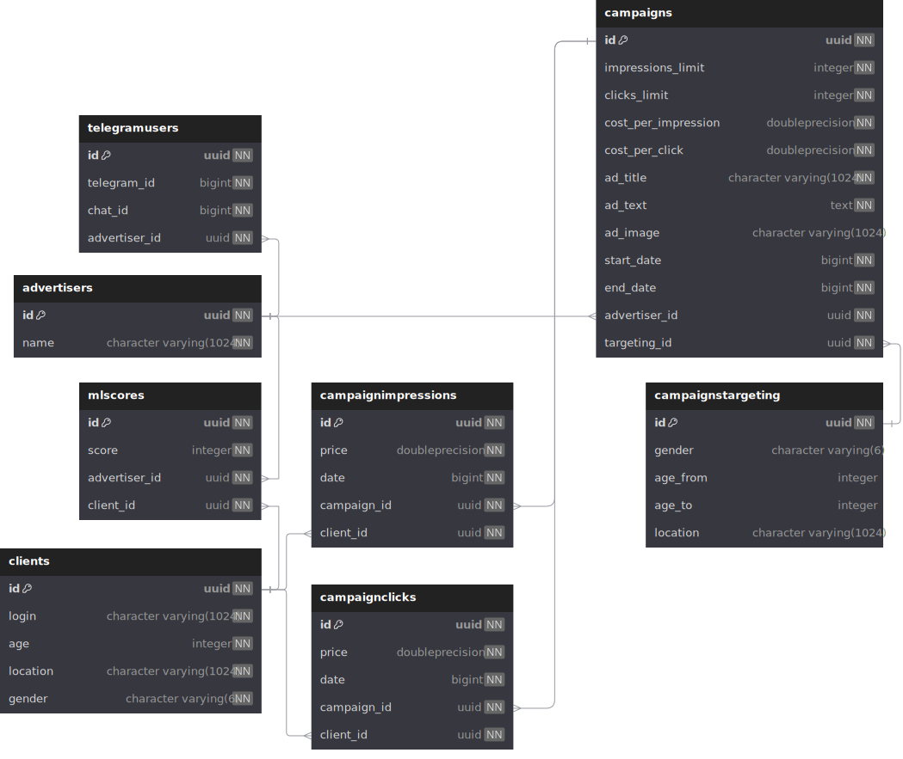

# Ads Platform API

[](https://t.me/AdsPlatformPRODBot)

## Содержание

<!-- TOC -->
* [Ads Platform API](#ads-platform-api)
  * [Содержание](#содержание)
  * [Запуск проекта](#запуск-проекта)
    * [Состав docker-compose](#состав-docker-compose)
    * [Конфигурация](#конфигурация)
    * [Запуск](#запуск)
    * [Запуск тестов](#запуск-тестов)
    * [Вход в Grafana](#вход-в-grafana)
    * [Вход в Web-UI MinIO:](#вход-в-web-ui-minio)
    * [Работа с Telegram ботом:](#работа-с-telegram-ботом)
  * [Демонстрация работы](#демонстрация-работы)
    * [API](#api)
      * [S3](#s3)
      * [Clients](#clients)
      * [Advertisers](#advertisers)
      * [Campaigns](#campaigns)
      * [Ads](#ads)
      * [Statistics](#statistics)
      * [Time](#time)
      * [GPT](#gpt)
    * [Telegram бот](#telegram-бот)
      * [Вход](#вход)
      * [Создание кампании](#создание-кампании)
      * [Мои кампании](#мои-кампании)
      * [Редактирование кампании](#редактирование-кампании)
      * [Статистика кампании](#статистика-кампании)
      * [Моя статистика](#моя-статистика)
    * [Grafana](#grafana)
  * [Состав таблиц БД](#состав-таблиц-бд)
  * [Описание работы основных точек входа](#описание-работы-основных-точек-входа)
      * [Этапы подбора объявления](#этапы-подбора-объявления)
      * [Расчёт эффективности (коэффициент K)](#расчёт-эффективности-коэффициент-k)
  * [Применяемые технологии и обоснованность их использования](#применяемые-технологии-и-обоснованность-их-использования)
    * [PostgreSQL](#postgresql)
    * [Redis](#redis)
    * [S3 и AioBotocore](#s3-и-aiobotocore)
    * [FastAPI](#fastapi)
    * [Aiogram (Telegram бот)](#aiogram-telegram-бот)
    * [Unit и e2e тесты](#unit-и-e2e-тесты)
    * [Grafana (Визуализация данных)](#grafana-визуализация-данных)
<!-- TOC -->

## Запуск проекта

Для запуска данного проекта, были подготовлены Dockerfile и docker-compose.yml

### Состав docker-compose

Docker compose состоит из следующих сервисов:

- PosgreSQL (основная БД) `db`
- Redis (БД для кэшей) `redis`
- MinIO (S3) `minio`
- REST API `api`
- Grafana (визуализация статистики) `grafana`
- Telegram бота `bot`
- MinIO MC (вспомогательный сервис, который создаёт бакет в S3 при запуске решения) `createbuckets`

### Конфигурация

Конфигурация приложения производится через .env файл в корневой директории проекта. Он имеет следующую структуру

| Название переменной |                  За что отвечает                   |
|:-------------------:|:--------------------------------------------------:|
|     POSTGRES_DB     |                Название базы данных                |
|    POSTGRES_USER    |         Имя пользователя, для доступа к БД         |
|  POSTGRES_PASSWORD  |              Пароль, для доступа к БД              |
|     START_DATE      |            Начальная дата в приложении             |
|   MINIO_ROOT_USER   |       Имя пользователя (Access Key ID) от S3       |
| MINIO_ROOT_PASSWORD |          Пароль (Secret Access Key) от S3          |
|  MINIO_BUCKET_NAME  |                Название бакета в S3                |
|  YANDEX_FOLDER_ID   |             ID директории Yandex Cloud             |
|   YANDEX_API_KEY    |        API ключ для доступа к Yandex Cloud         |
| TELEGRAM_BOT_TOKEN  |                Токен Telegram бота                 |
|   STATE_TTL_HOURS   | Время жизни (в часах) текущего стейта пользователя |
|   DATA_TTL_HOURS    |  Время жизни (в часах) данных стейта пользователя  |
|       API_URL       |    Базовый URL, для запросов к REST API из бота    |

### Запуск

Для запуска проекта может быть использована следующая команда:

> Важно! Если развёртывание docker-compose происходит на системе Linux, то потребуется выдать права на редактирование
> grafana.db, иначе в неё будет невозможно войти. Для этого может быть использована следующая команда:
> `chmod a+w ./grafana.db`

```bash
docker compose up --build -d
```

### Запуск тестов

Для удобства тестирования проекта, посредством E2E и Unit тестов, был подготовлен специальный контейнер.

> Важно! Тесты предполагают отсутствие данных в БД. В случае, если проект уже использовался,
> например, были созданы кампании или изменена дата, то перед запуском тестов потребуется сбросить БД.
> Это может быть сделано, с использованием следующей команды: `docker compose down -v`

Для запуска проекта в режиме тестирования может быть использована следующая команда:

```bash
docker compose --profile tests up --build
```

### Вход в Grafana
Grafana доступна на URL: http://REDACTED:3000  
Для доступа была создана специальная учётная запись: `prod`:`prod`

### Вход в Web-UI MinIO
Web-UI MinIO доступен на URL: http://REDACTED:9189  
Для входа требуется использовать значения переменных `MINIO_ROOT_USER` и `MINIO_ROOT_PASSWORD`

### Работа с Telegram ботом
Пр запуске данного проекта будет доступен следующий Telegram бот:  
https://t.me/AdsPlatformPRODBot

## Демонстрация работы

### API

Ниже представлены скриншоты примеров всех запросов на REST API  
Для удобного ознакомления с составом полей рекомендуется перейти на
http://REDACTED:8080/docs

#### S3

Получение файла


Удаление файла


#### Clients

Создание и обновление клиентов


Получение клиента по ID


#### Advertisers

Создание и обновление рекламодателей


Получение рекламодателя по ID


#### Campaigns

Создание рекламной кампании


Получение списка рекламных кампаний


Получение рекламной кампании


Редактирование рекламной кампании


Удаление рекламной кампании


#### Ads

Получение рекламного объявления для клиента


Клик по рекламному объявлению


#### Statistics

Получение общей статистики рекламной кампании


Получение дневной статистки рекламной кампании


Получение общей статистики рекламодателя


Получение дневной статистики рекламодателя


#### Time

Изменение времени


Получение текущего времени


#### GPT

Модерация текста


Генерация текста


### Telegram бот

Ниже представлено краткое описание взаимодействия с Telegram ботом

#### Вход

После отправки /start, пользователю предлагается создать или войти в аккаунт рекламодателя с данной платформы.


После успешного входа, пользователь может выбрать желаемое действие. Например, создать новую рекламную кампанию


#### Создание кампании

При нажатии на кнопку "Создать кампанию", пользователь последовательно указывает её данные:

- Название
- Описание
- Изображение (можно пропустить)
- Дата начала и дата окончания
- Целевое число просмотров и переходов (кликов)
- Стоимость одного просмотра и перехода (клика)
- Параметры таргетинга (можно пропустить)

#### Мои кампании

После нажатия на кнопку "Мои кампании", пользователь получает список его компаний с подробным описанием,
через который может ими управлять.


#### Редактирование кампании

После нажатия на кнопку "Редактировать", пользователю необходимо выбрать категорию параметров
(это сделано для удобства)


Ниже представлены фото каждой категории:


При редактировании данных, сохранение происходит после успешного редактирования поля.  
Также происходит валидация данных от пользователя, чтобы исключить некорректные значения.

#### Статистика кампании

При нажатии на кнопку "Статистика", пользователю отправляется статистика по рекламной кампании.   
Она может быть представлена в двух видах:

1. Общая (за всё время)  
   
2. Ежедневная с пагинацией по неделям  
   

#### Моя статистика

При нажатии на кнопку "Моя статистика", пользователь получает статистику по своему рекламодателю.
Также, как и у кампании, она доступна в двух вариантах:

1. Общая (за всё время)  
   
2. Ежедневная с пагинацией по неделям  
   

### Grafana

Для удобной визуализации статистики платформы, была настроена Grafana.  
Для входа в неё создана специальная учётная запись `prod`:`prod`


## Состав таблиц БД

База данных имеет следующую схему таблиц и полей:



Поле `ad_image` в таблице `campaigns` представляет собой путь до файла на S3

Поле `gender` в таблице `clients` является Enum'ом, который принимает в себя два значения:

- MALE
- FEMALE

Поле `gender` в таблице `campaignstargeting` является Enum'ом, который принимает три значения:

- MALE
- FEMALE
- ALL

## Описание работы основных точек входа

#### Этапы подбора объявления

Получение подходящей рекламы для пользователя происходит в четыре этапа:

1. Получение реклам из базы данных. На данном этапе происходит фильтрация всех реклам, для получения активных кампаний,
   которые соответствуют пользователю по таргетингу.
2. Для каждой полученной рекламы происходит расчёт коэффициента эффективности K. Для реклам, которые не набрали
   минимальное число просмотров (50), K будет равен 0
3. Со случайным шансом мы можем либо показать пользователю рекламы,
   которые набрали мин. статистику, либо которые не набрали. Это нужно для продвижения разных реклам:
    1. Если сработал шанс на показ реклам, с K > 0, то происходит сортировка всех реклам по K и выбор рекламы, с самым
       высоким значением коэффициента.
    2. Если сработал шанс на показ рекламы, с K = 0 (не набрала мин. статистику), то происходит выбор случайной рекламы.
4. Выбранное объявление возвращается пользователю и мы засчитываем просмотр.

Шансы составляют 60/40, где 60 - шанс показа рекламы, с K > 0

#### Расчёт эффективности (коэффициент K)

При расчёте эффективности показа объявления учитываются следующие факторы:

- Число кликов и переходов по объявлению
- Лимиты кликов и переходов объявления
- Шанс клика по этому объявлению (для этого и существует минимальное число просмотров)
- Шанс клика пользователя
- ML Score
- Коэффициенты для удобной настройки формулы

Для настройки формулы существуют следующие коэффициенты:

- $I = 0.85$ - пороговое значение просмотров
- $C = 0.92$ - пороговое значение переходов
- $M = 15$ - множитель к результату $log(MLScore(A))$

Обозначения:
- $Impression(A)$ - стоимость одного просмотра
- $Click(A)$ - стоимость одного перехода (клика)
- $P(A)$ - шанс клика по объявлению (как часто люди переходят по этому объявлению)
- $P(C)$ - шанс клика пользователя (как часто пользователь переходит по банерам)
- $ICount(A)$ - количество просмотров объявления
- $ILimit(A)$ - целевое (максимальное) число просмотров объявления
- $CCount(A)$ - количество переходов (кликов) по этому объявлению
- $CLimit(A)$ - целевое (максимальное) число переходов (кликов) у этого объявления
- $MlScore(A)$ - ML-Score этого объявления для клиента 
(является ML-Score'ом рекламодателя, создавшего объявление, для этого клиента)

Формула для расчёта K выглядит следующим образом:

$K = Impression(A) * 3 + Click(A) * (\frac{P(A)+P(C)}{2}) * (1 - \frac{\max(I, \frac{ICount(A)}{ILimit(A)}) - I}{1.1 - I}) * (1 - \frac{\max(C, \frac{CCount(A)}{CLimit(A)}) - C}{1.1 - C})$

Затем K изменяется с учётом ML-Score:

$K = K + \min(\log(MlScore(A) + 1) * M, K * 0.25)$

## Применяемые технологии и обоснованность их использования

### PostgreSQL

В качестве БД, отвечающей за хранение данных о клиентах, рекламодателях и кампаниях была выбрана PostgreSQL.  
Главной причиной её выбора является её тип - реляционная БД, то есть реализующая и систематизирующая
определённые связи между её таблицами.  
Это является важным аспектом при выборе, так как данные проекта явно связаны друг с другом.  
Кроме этого, данная БД показывает высокую скорость обработки SQL запросов любой сложности, что тоже является
важным критерием в пользу её выбора.  
Также стоит отметить низкое потребление ресурсов системы при её работе, даже в условиях высокой нагрузки.

Для взаимодействия с PostgreSQL из кода используется библиотека Tortoise ORM из-за синтаксиса, близкого к DjangoORM,
гибкого движка запросов, быстрого формирования запросов и их выполнения и простоты использования.

### Redis

Данная нереляционная база используется на проекте для двух задач:

1. Хранение кэшей API (Например, текущей даты)
2. Хранение стейтов пользователей в телеграм боте

Данная база данных хранит все значения в оперативной памяти, что позволяет ей получать и изменять данные
максимально быстро (чаще всего, это занимает менее 1 мс.).  
Благодаря этому мы можем гарантировать быстрый доступ
ко всем данным, которые хранятся в ней, даже при частых запросах.

Ещё одной важной и полезной особенностью является возможность установки времени жизни (TTL) для данных в ней.  
Это полезно в тех случаях, когда, например, пользователи Telegram бота прекращают его использование и
забывают завершить какое-либо действие.  
Из-за этого мы продолжаем тратить ресурсы на хранение неиспользуемых (бесполезных) данных,
чего можно избежать благодаря этой особенности.

Для взаимодействия с этой базой данных была выбрана официальная библиотека redis с расширением hiredis,
которое ускоряет её работу, благодаря своей реализации на чистом C.  
Причинами выбора стало наличие документация, а также её разработчик (сама Redis).

### S3 и AioBotocore

В качестве локального сервера S3 был выбран MinIO. Причинами выбора в его пользу стали:
полная реализация и поддержка протоколов AWS S3 и наличие Web-UI для управления объектным хранилищем.

Для взаимодействия с ним используется библиотека aiobotocore, которая является асинхронной версией
низкоуровневой библиотеки botocore. На основе выбранной библиотеки был написан асинхронный клиент.

### FastAPI

Для написания REST API был выбран фреймворк FastAPI по следующим причинам:

- Асинхронность (возможность одновременной обработки нескольких запросов)
- Скорость обработки запросов
- Удобная и быстрая валидация данных, с использованием Pydantic
- Поддержка большого количества технологий "из коробки"
- Простой синтаксис и высокая скорость разработки
- Очень подробная и простая в понимании документация с примерами.

### Aiogram (Telegram бот)

Для создания Telegram бота был использован фреймворк Aiogram по следующим причинам:

- Асинхронность (возможность одновременной обработки нескольких запросов)
- Полное соответствие и реализация Telegram Bots API
- Высокая скорость обработки
- Реализация стейт машины "из коробки" (хранение данных о текущем действии пользователя)
- Наличие документации для каждого метода и прописанные типы с составом полей
- Огромное число пользователей

### Unit и e2e тесты

Для реализации тестов, проверяющих корректность работы данного проекта была выбрана библиотека PyTest,
а также её расширение Tavern.

Библиотека Tavern была выбрана для написания E2E тестов из-за её высокого удобства:  
тесты создаются в виде yaml файлов, что делает их написание очень быстрым и легким в понимании для всех людей.  
Возможность написания тестов без использования кода, в разы ускоряет процесс написания тестов.

### Grafana (Визуализация данных)

Для визуализации статистики по рекламодателям была выбрана Grafana.
Данный сервис позволяет с большой лёгкостью создавать дашборды и строить графики.  
Она поддерживает огромное множество (больше 100) различных источников данных, что делает её универсальным решением.  
Кроме этого, большое количество типов графиков покрывает любые требования и предоставляет большое число возможностей.  
Также немало важным фактором в пользу её выбора является простота в развёртывании (1 Image).  
Данные факторы делают Grafana идеальным выбором для данного проекта.
